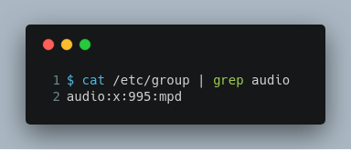

# netease-cloud-music images

---

fork from [bestwu/docker-netease-cloud-music](https://github.com/bestwu/docker-netease-cloud-music)

---

## 步骤

1. 允许所有用户访问X11服务：

​        

2. 获得`$audio_gid`

    

   > $audio_gid=995

3. 修改[Dockerfile](./DockerFile)和[docker-compose.yaml](./docker-compose.yaml)，然后执行：

